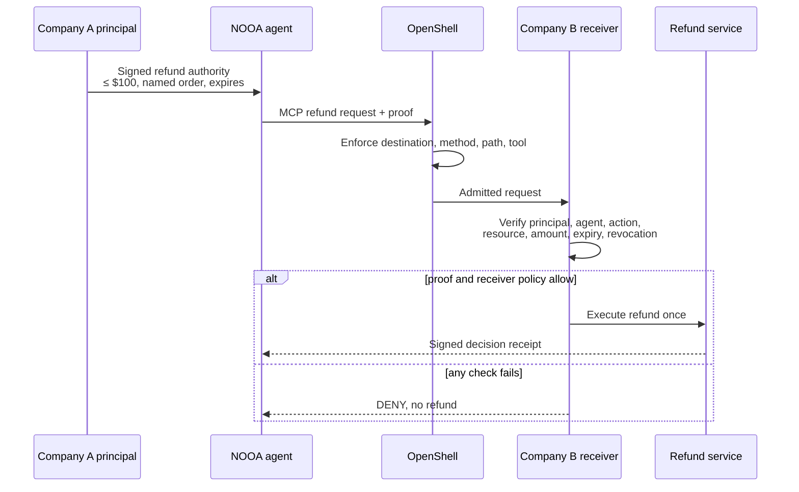

# Proof-Carrying Delegated Authority

**An agent asks another company's service to move money. The service verifies who authorized that agent, for exactly this action, within exactly these limits, before it acts.**

A working reference contribution for [NOOA](https://github.com/NVIDIA-NeMo/labs-OO-Agents) and NVIDIA's open agent-security stack, built on [Ratify Protocol](https://github.com/identities-ai/ratify-protocol).

Run it in five minutes. No API key, no model, no paid service.

```bash
cd sdks/python && python -m venv .venv && source .venv/bin/activate
pip install -e . && cd ../..

python demos/nvidia-nooa-delegated-authority/scenarios.py
python -m pytest demos/nvidia-nooa-delegated-authority/test_verification.py -q
```

---

## Why this exists

A refund agent runs at Company A. It calls a payments service at Company B.

Company A's principal intended something precise: *this agent may issue refunds up to $100, for the next 24 hours.*

By the time the request arrives at Company B, that intent has usually collapsed into an API key in a header. Company B learns that some caller holding some credential wants $150 refunded. It does not learn who authorized the agent. It does not learn that the ceiling was $100 rather than $10,000. It does not learn whether the authority was revoked ninety seconds ago. And it cannot tell whether the agent presenting the credential is the agent the credential was issued to.

Company B executes the refund and absorbs the loss. **The party carrying the risk has the least evidence of anyone in the chain.**

That inversion is what this reference addresses. The principal's limits are signed, they travel with the request, and the receiving service verifies them locally before acting. A misconfiguration or prompt injection inside Company A stops being Company B's liability.



## Where it fits

NVIDIA's open stack already answers most of the questions worth asking about an agent. This reference addresses one that sits alongside them.

| Layer | Question it answers | Who authors the answer |
|---|---|---|
| **NOOA** | What is the agent doing, and how is it traced? | The agent's operator |
| **NeMo / guardrails** | Does this interaction comply with enterprise policy? | The enterprise, centrally |
| **OpenShell** | What may this runtime reach, via which MCP method and tool? | The runtime's operator |
| **SPIFFE/SPIRE** | Which workload is calling? | The trust domain |
| **Ratify Protocol** | Who authorized this agent for this action, within what limits? | **The principal, in another organization** |

The last row is the distinction worth pausing on. Every other layer is authored and enforced by the party running the infrastructure. A delegation proof is authored by a principal who may be in a different company entirely, and it is verified by a receiver that has never spoken to that principal's systems. That is what makes it portable evidence rather than local configuration.

Ratify Protocol replaces none of these layers. Workload identity still authenticates the caller. Guardrails still evaluate the interaction. Policy engines still apply local rules and may still deny. This layer establishes that authority exists and is in scope; everything else keeps its job.

## How the workflow runs

The agent describes what it wants. The receiver decides what the request *is*, and then whether to honor it.

### Phase 1: the receiver defines the operation

```
agent  ──▶  POST /refunds/challenge   { order_id, amount, currency, agent_id }
```

The receiver takes the agent's word for nothing. It parses the amount itself, chooses the scope the operation requires, builds a canonical description of the action, derives a binding hash from that description, and issues a single-use challenge bound to it.

```
agent  ◀──  { challenge, session_context, expires_at }
```

### Phase 2: the agent proves possession, the receiver decides

```
agent  ──▶  POST /refunds   { challenge, ProofBundle }
```

The agent signs the receiver's challenge with its own private key and attaches the delegation chain. The receiver then, in order:

1. Confirms the proof answers the challenge it actually issued
2. Confirms the proof carries the binding the receiver created, byte for byte
3. Confirms the pending request is still live
4. Confirms the presented key is the agent the challenge was issued to
5. Verifies proof of possession over its own challenge and its own binding
6. Retires the pending request atomically, so one challenge yields at most one decision
7. Confirms the delegation chain terminates at a principal it was configured to trust
8. Verifies the chain: signatures, expiry, revocation, scope, and every constraint (the $100 ceiling, and any named order) against the values *it* parsed
9. Executes or refuses, then signs and chains a receipt

```
agent  ◀──  { decision, status, reason, refunded, receipt_id }
```

Steps 1 through 5 are the authentication gate. Nothing above it can mint a receipt or retire a request, because everything above it is reachable by an unauthenticated caller.

**Authority can name the resource it covers.** *"Refund up to $100"* and *"refund up to $100 for this order"* are very different grants. Without the second, an agent authorized to refund one customer can refund every customer, one order at a time, never exceeding the ceiling. Ratify Protocol v1.0.0-alpha.16 added `resource_path` constraints, so a delegation can name the single resource it authorizes.

The protocol treats `resource_id` as an opaque string compared by **exact byte equality**, with no case folding, percent-decoding, or normalization of any kind. That is deliberate, and it means canonicalization is the application's responsibility: an application that accepts two spellings of one resource has two resources as far as verification is concerned. This receiver therefore pins a single tenant-qualified form, `tenant/acme/orders/ord-9`, rejects anything that does not fit it, and uses that one value for both the session binding and the constraint. Tenant qualification is not decoration. Two tenants can each have an order numbered 8841, and a delegation naming a bare `8841` would authorize both, which is a cross-tenant authorization bug that looks correct in every log. A resource constraint evaluated with no resource context fails closed as `constraint_unverifiable`.

**The critical property: the agent's process contains no authorization logic.** The NOOA adapter presents a proof and reports a verdict. It cannot allow anything. An agent-side check would be worthless as a control, since a compromised or misaligned agent simply would not run it. The reference therefore has no such check, not even an advisory one, and a test asserts its absence.

## What the reference proves

Each denial is asserted against a specific reason code, so none of them can pass by accident.

| Attempt | Result |
|---|---|
| $75 refund inside a $100 bound | `authorized_agent` |
| $150 against the principal's $100 ceiling | `constraint_denied` |
| Delegation that lapsed an hour ago | `expired` |
| Delegation the principal revoked | `revoked` |
| Revocation source unreachable | fails **closed**, never open |
| Certificate presented by a key it was not issued to | `key_mismatch` |
| Thief who cannot answer the challenge | `bad_challenge_sig` |
| A valid presentation replayed | `unknown_challenge` |
| Amount restated in the execution request | ignored; the receiver's parse stands |
| Proof captured and reused under a fresh challenge | refused, and the victim's challenge survives |
| Proof bound to a different operation | `session_binding_mismatch` |
| Child certificate claiming scope its parent never held | `scope_denied` |
| Child certificate raising the parent's $100 ceiling to $1,000 | `constraint_denied` |
| Refund for an order the delegation does not name | `constraint_denied` |
| Another tenant's order with the same local number | `constraint_denied` |
| Non-canonical order id (traversal, spaces, over-length) | `400` before a challenge is issued |
| Resource constraint with no resource context supplied | `constraint_unverifiable`, fails closed |
| Subdelegation without `identity:delegate` | `delegation_not_authorized` |
| Chain rooted at a principal the receiver never configured | `unauthorized` |
| Twelve concurrent decisions | one unbroken receipt chain, no lost refunds |
| Twenty-five fabricated pre-authentication presentations | zero receipts appended |
| NaN, infinite, negative, or zero amount | `400` before a challenge is issued |
| Malformed JSON, array body, bad base64, wrong types | deterministic `4xx` |

**181 tests: 177 hermetic and 4 mandatory NOOA integration tests.** The hermetic suite needs neither NOOA nor an LLM nor a container runtime, so the security claims are verifiable in one command from a clean checkout. The NOOA tests exercise the real released middleware API, and they are required to run rather than permitted to skip in `scripts/nooa-integration-check.sh`.

## The live OpenShell profile

`run-openshell-profile.sh` executes the whole composition against a pinned OpenShell v0.0.102 gateway:

> NOOA agent → proof-carrying MCP Streamable HTTP → OpenShell destination, method, and tool enforcement → an independent MCP receiver → Ratify semantic authorization → consequential action → signed receipt

One command from a clean checkout brings the gateway up on dynamic ports from immutable image digests, renders the sandbox policy, drives **52 cases in seven isolated groups** from inside an OpenShell sandbox, audits every log source for per-run canaries, writes a machine-readable artifact, and removes exactly what it created. It needs Docker and takes two to four minutes. It is deliberately **not** part of the five-minute claim; the hermetic suites are.

| Group | What it establishes |
|---|---|
| `positive_and_replay` | The one path that may move money, and that replaying the same presentation cannot move it again |
| `ratify_semantic_denials` | Thirteen denials OpenShell cannot see and is not asked to (amount, resource, tenant, expiry, revocation, revocation failure, wrong key, untrusted root, scope and constraint amplification, cross-request proof movement, invalid challenge, malformed proof), plus two authorize controls that isolate what is actually causing them |
| `maximum_depth` | An eight-certificate alpha.16 chain, 88,990 bytes, carried inline in `_meta` and authorized |
| `size_boundaries` | Three independent limits, each enforced by a different component against a different quantity |
| `parser_differentials` | Fifteen probes of one invariant: admitted as X, never dispatched as Y. A separate coverage gate requires the matrix to have actually exercised both the admission and the denial branch, since the invariant alone is satisfiable by a policy that denies everything |
| `destination_path_port` | Unauthorized destination, wrong port, wrong path, unlisted tool, disallowed method, and the control endpoint, all refused before MCP ingress |
| `nooa_full_path` | The composed path: one NOOA capability call, carried over MCP through an OpenShell policy to an independent receiver, authorized by Ratify, in a single process that imports `nooa` exactly once — measured by an import audit hook, not declared |

`log_canaries` is a separate, non-adjudicated pass: it re-exercises cases from the groups above so the log audit has each shape of traffic to search against. The gate is the canary search, not a per-case verdict.

**Stability.** All seven groups passed 64/64 gates in one full OpenShell v0.0.102 compatibility run against the published `ratify-protocol==1.0.0a16`. That live run has not been repeated since the pins moved to `1.0.0a19`; the hermetic suite has, and the sandbox lock still resolves `pqcrypto==0.4.0`, which is the dependency the move was made for. The earlier v0.0.96 campaign also passed twice sequentially and twice concurrently. The unified path's early instability, imported once per case, exhausted the sandbox, was resolved by importing `nooa` exactly once per suite process instead; see [`docs/evidence/nvidia-reference-evidence.md`](../../docs/evidence/nvidia-reference-evidence.md) for the version-separated run evidence, including a disclosed, bounded retry added for a transient `sandbox download` flake under concurrent load.

**How a case is judged.** Each case declares its expected outcome (`authorize`, `deny_at_openshell`, `admit_as:<tool>`, or `deny_at_ratify:<status>`) and every boundary delta it may produce. The runner takes a snapshot of the receiver's counters immediately before and immediately after that case, from a loopback control endpoint the sandbox cannot reach, and compares. A missing case, a missing snapshot, a stale sequence number, a partial result, or an event the deltas do not account for is a **failure**, never a skip. No gate can pass because a record merely exists: `test_adjudicator.py` feeds the adjudicator evidence of each violation in turn and asserts it says FAIL.

**What one run proves, and what it does not.** The artifact records component digests, the resolved platform digest, the executed architecture, policy and gateway configuration hashes, every case with its expected and actual outcome, per-case boundary deltas, proof sizes and hashes, the log sources inspected with canary hit counts, and an explicit `not_executed` list plus enumerated `known_limitations`. It never contains a private key, a full proof, or a JWT. Claims about architectures, runtimes, or configurations that were not executed are recorded as limitations rather than results.

## Files

| File | Role |
|---|---|
| `principal.py` | Creates authority. The only place delegations are signed. |
| `refund_service.py` | **The receiver.** Verifies, decides, acts, and signs receipts for authenticated decisions. |
| `agent_client.py` | Carries the proof and answers the challenge. Decides nothing. |
| `nooa_adapter.py` | NOOA presentation adapter, via `intercept("agent_call", ...)`. |
| `scenarios.py` | The narrated run. |
| `mcp_server.py` | The MCP Streamable HTTP boundary. Contains no authorization logic. |
| `openshell_probe.py` | The receiver, the append-only event log, and the loopback control plane. Holds every private key in memory and never serializes one. |
| `openshell_client.py` | Runs inside the sandbox. Sends one case, reports what happened, interprets nothing. |
| `openshell_cases.py` | Case expectations and the adjudicator. Pure functions over recorded evidence. |
| `openshell_driver.py` | Orchestration: bounded external calls, per-case snapshots, the artifact. |
| `run-openshell-profile.sh` | Environment setup and teardown around the driver. |
| `test_verification.py` | 54 hermetic receiver-security tests. No NOOA, no LLM. |
| `test_mcp_transport.py` | 39 hermetic MCP transport and proof-carriage cases. |
| `test_adjudicator.py` | 84 cases proving the adjudicator fails each incomplete or inconsistent evidence shape. |
| `test_nooa_presentation.py` | 4 tests against released NOOA. |

## The NOOA integration seam

`agent.event_manager.intercept("agent_call", fn)` from `nooa.runtime.middleware`. Public API, exported in `__all__`, documented in NOOA's own `skills/nooa-middleware-hooks/SKILL.md`, and covered by `tests/test_event_middleware.py`. The module in released `nooa==0.0.8` is byte-identical to `main`.

NVIDIA established this pattern for third-party security integration: `src/nooa/nemo_flow_middleware.py` routes agent calls through NeMo Flow guardrails using the same three middleware kinds. This adapter deliberately mirrors that shape.

The agent capability is an ordinary `async` method, so NOOA dispatches it without an LLM round-trip. `FakeLLMClient`, NOOA's public double for hermetic testing, satisfies the constructor. The test suite subclasses it to raise if a call is ever attempted, which makes "no LLM" a tested property rather than a claim.

`InstrumentationHooks` was considered and rejected on two grounds. Its exceptions are swallowed by design, so it cannot block. And it occupies a single contextvar slot that `enable_tracing()` already uses, so installing hooks there would silently disable NOOA tracing. Both facts come from NOOA's own documentation.

To run the NOOA tests, on Python 3.12 or 3.13:

```bash
pip install nooa==0.0.8
python -m pytest demos/nvidia-nooa-delegated-authority/ -q
```

A skip is acceptable locally. It is not acceptable everywhere, so `scripts/nooa-integration-check.sh` builds a clean environment, installs `nooa==0.0.8`, and **fails if the module skips.**

## What this does not claim

A reference that overstates itself is worse than no reference, so the limits are explicit.

**Receipts are the verifier's own signed assertion**, bound by hash to the exact proof presented. Chaining detects modification of a retained earlier receipt, interior removal when a later receipt is retained, reordering, and forking. It does **not** detect deletion of the final receipt or truncation of the tail, because a chain cut short is internally consistent and verifies perfectly. Catching that requires something outside the verifier: a published checkpoint, a witness, a trusted counter, or another party holding a later chain head. This is not third-party attestation. A dishonest verifier can sign whatever it likes.

**Receipts cover authenticated presentations only**, at most one per issued challenge. Traffic refused before proof of possession produces an unsigned, bounded operational-log entry instead. Otherwise an unauthenticated caller could append signed entries at will and bury real decisions in noise.

**Failure receipts carry empty identity fields.** Expiry and revocation are evaluated before the chain signature is verified, so the identifiers available at that moment come from a certificate nobody has authenticated yet. This receiver blanks them rather than signing an unearned claim that a named principal was present. That is this reference's conservative policy and not a settled protocol requirement; the presentation stays recoverable through the receipt's bundle hash.

**Non-amplifying subdelegation works by intersection, not rejection.** A child certificate claiming a scope its parent never held is not refused as malformed. The amplified scope simply never enters the effective set, so the action denies as `scope_denied`. Constraints behave differently: every certificate's constraints are evaluated conjunctively, so a parent's $100 ceiling still binds a child that wrote itself a $1,000 one. The enforcement is real, and the mechanism is worth describing accurately.

**Replay protection is single-process.** `MemoryChallengeStore` is a lock-guarded dictionary. Replicas sharing traffic would each accept a challenge once. A multi-host deployment needs a store whose consume is atomic across nodes, such as a single-row `DELETE ... RETURNING`.

**Amounts are a security boundary, not input hygiene.** The `max_amount` constraint is enforced as `requested_amount > max_amount`, and every ordered comparison against NaN is false, so a NaN amount clears any ceiling. Python's JSON parser accepts a bare `NaN`, which made this reachable by any caller: an earlier version of this reference authorized a NaN refund and poisoned its ledger total permanently. Negative infinity and plain negative values pass for the same reason, and a negative refund is a charge. The receiver now rejects non-finite, non-positive, and non-numeric amounts before building an operation context. Handing an unvalidated float to a verifier and expecting the verifier to catch it is the mistake. Production financial systems should carry canonical decimal or integer minor units; that change is out of scope here.

**Two things sit outside the threat model.** A compromised receiver executes the action and signs its own receipts, so no protocol can stop it lying about its own decision. And a compromised agent runtime, operating *within the bounds already delegated*, can issue refunds up to $100 until expiry or revocation. This layer bounds the blast radius and makes it revocable. It does not eliminate it.

## Environment

Requires Ratify Protocol v1.0.0-alpha.19, published and installed from PyPI: all 181 tests pass with `nooa==0.0.8` on Python 3.12 via `RATIFY_SDK=published ./scripts/nvidia-reference-check.sh`, which fails on any skip and asserts that `ratify_protocol` resolves outside this repository. The live profile passed 64/64 once on OpenShell v0.0.102; the earlier v0.0.96 stability campaign passed twice sequentially and twice concurrently. The dependency is real rather than nominal: the resource-bound scenario uses alpha.16's `resource_path` constraint, and those tests fail on alpha.15 because the constraint type does not exist there. The receiving service uses only the Python standard library, because a protocol reference should not need a web framework to be understood. Apache-2.0.

## Beyond this reference

Two directions extend the same receiver-side pattern. Neither is implemented here, and neither is claimed. OpenShell composition used to sit in this list; it is now executed, and is described above.

**SPIFFE workload identity.** Bind the authenticated workload identity into the session context, so a valid delegation replayed from a different workload fails cryptographically rather than by policy. This is a specification change requiring protocol review, which is why it is deliberately absent from a demonstration.

**Physical AI.** The same constraint machinery covers geofences and kinematic bounds alongside monetary ones, evaluated by the same verifier. The pattern extends to an actuation boundary on Jetson or IGX, where a principal delegates a bounded mission and the actuation service verifies it before commanding motion. That requires hardware, latency measurement, and a safety analysis, none of which exist yet.

---

Architecture, threat model, and open questions for NVIDIA engineers: [`docs/nvidia-open-secure-ai-reference-proposal.md`](../../docs/nvidia-open-secure-ai-reference-proposal.md). Full evidence, hashes, and known limitations: [`docs/evidence/nvidia-reference-evidence.md`](../../docs/evidence/nvidia-reference-evidence.md).

Ratify Protocol is published by Identities.AI, Inc., and is a member of NVIDIA Inception. This is an independent reference implementation. It is not an NVIDIA partnership, not an approved or official integration, not an NVIDIA reference architecture, and not an Open Secure AI Alliance membership artifact. No NVIDIA repository is modified by this contribution. Every result above comes from executions recorded in the profile's own artifact, on the single platform recorded there: arm64 macOS with Docker. linux/amd64 and Podman are compatibility targets, not results.
