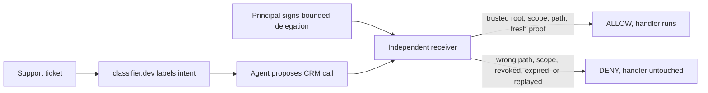
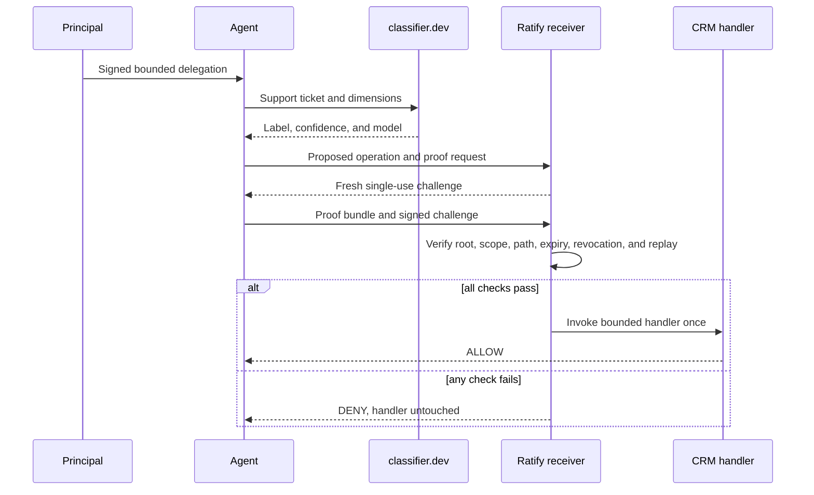

# classifier.dev × Ratify Protocol

**Let an open classifier route agent work without turning tenant access into unlimited authority.**

classifier.dev is a keyless, zero-shot text classifier that returns labels and calibrated confidence over plain HTTP. This reference shows what happens after that semantic result becomes a consequential CRM call: classifier.dev proposes the operation, while an independent Ratify receiver verifies the delegated authority before the protected handler runs.

This is an independent Ratify Protocol reference. It is not a classifier.dev partnership, endorsement, or official architecture. Start with the [source and executable gate](https://github.com/identities-ai/ratify-classifier-reference) or the [Ratify Verify path](https://ratifyprotocol.com/#partners).

## Why would a developer or enterprise need this?

classifier.dev intentionally makes classification as easy to call as search or scraping. That is appropriate for a read-only belief. The security question begins downstream, when a label routes an agent into a write.

| Question | classifier.dev and tenant controls | Ratify authority |
| --- | --- | --- |
| What does this ticket appear to request? | classifier.dev answers | Not its purpose |
| Can this authenticated agent reach the CRM? | Tenant credential answers | Not its purpose |
| Did a recognized principal authorize this agent for this exact bounded call? | Not carried by a bearer credential | Receiver verifies a portable proof |
| Was the requested customer path outside the mandate? | Application-specific | Resource constraint is checked before the handler |
| Was the proof revoked, expired, or replayed? | Separate concern | Receiver checks freshness, revocation, and single use |

The demo uses an ambiguous Anderson account. The classifier correctly proposes an update, but deterministic downstream resolution chooses customer 007. Tenant access executes because 007 is a valid Acme object. Ratify stops the call because the principal's delegation names customer 482.



## Who implements what

| Role | What it does | What it builds |
| --- | --- | --- |
| Principal | Sets the authority ceiling for the CRM action | Authenticated issuer workflow and bounded delegation |
| Agent operator | Calls classifier.dev and carries the proof to the receiver | Adapter that keeps keys and proof bytes outside model context |
| Receiver operator | Reconstructs the operation, verifies authority, guards the CRM handler | Challenge store, trust-root policy, revocation source, and allow branch |
| classifier.dev | Returns a semantic label and confidence | Nothing for this integration |
| Ratify Protocol | Defines the portable delegation and proof semantics | Nothing in classifier.dev or the agent framework |

The party carrying the consequence is the enforcement boundary. The classifier and agent can propose a call, but they cannot make the receiver execute it.

## What does this reference do?

The fixture principal delegates the following bounded authority to a support agent:

```text
scope       data:write
resource    crm:tenant/acme
path        /customers/482/billing-address
expiry      10 minutes
single use  receiver challenge
```

The Worker prepares that delegation before calling classifier.dev. The label selects a typed operation. The receiver then binds the presented proof to the operation, path, payload digest, verifier, workspace, session, and invocation before it can reach the handler.



The receiver, not the prompt, classifier, model, or UI, is the security boundary.

## What the reference proves

| Tested case | Receiver result | Handler effect |
| --- | --- | --- |
| Customer 482 update inside the mandate | Allow | Tenant and authority lanes invoke |
| Anderson resolves to customer 007 | Deny at resource constraint | Tenant lane invokes, authority handler untouched |
| classifier.dev proposes a read | Deny at scope | Tenant read lane may proceed, authority handler untouched |
| Same bearer call is replayed | Deny at consumed challenge | Tenant lane invokes twice, authority once |
| Delegation is revoked | Deny at revocation | Tenant lane remains usable, authority handler untouched |

The source gate currently runs six tests with zero skips: five receiver cases plus a live-schema parser test using a bounded classifier.dev response fixture. Public publication requires regenerating the evidence record after the source repository is available on its public `main` branch.

## Use it now

```bash
git clone https://github.com/identities-ai/ratify-classifier-reference.git
cd ratify-classifier-reference
npm ci
cp .dev.vars.example .dev.vars
npm run check
npm run dev
```

The demo needs no classifier.dev API key. A local router token and privacy salt are required only for the receiver's local boundary and rate gate. The checked-in identity fixtures are public and must not be reused in production.

## Which path should I use?

Use this open reference to inspect the receiver, adapt the operation mapping, and run the gate without a hosted Ratify dependency. It is the fastest way to understand where delegated authority enters an existing classifier or agent flow.

Use Ratify Verify when your organization wants managed trust configuration, revocation freshness, replay state, audit retention, availability, and supported receiver adapters. The proof semantics remain portable.

## What is cryptographically bound?

The principal-signed certificate carries the issuer and agent identities, `data:write` scope, Acme tenant resource, customer 482 billing-address path, issue time, expiry, and hybrid signature. The receiver reconstructs and binds the operation name, required scope, requested path, payload digest, verifier, workspace, session, invocation, and challenge context. The classifier label and confidence are inputs to application routing; Ratify does not certify their correctness.

## Repository map

| File | Purpose |
| --- | --- |
| `src/classifier.ts` | Calls and validates classifier.dev's multidimensional response |
| `src/operation.ts` | Converts a classifier label into a typed CRM operation and binding |
| `src/authority.ts` | Issues the public fixture delegation and challenge response |
| `src/demo-session.ts` | SQLite-backed Durable Object receiver and challenge store |
| `src/worker.ts` | Closed Labs origin, rate gate, classifier boundary, and API |
| `web/` | Visual side-by-side explanation and outbound links |
| `test/worker.test.ts` | Executable allow/deny matrix |

## Evidence, security status, and limitations

The tested dependency pins are Ratify `1.0.0-alpha.20`, classifier.dev's documented dimensions API, Wrangler `4.135.0`, Vite `8.3.0`, and the Cloudflare Workers runtime supplied by the gate. The reference is not a production CRM, identity issuer, revocation service, audit system, or classifier accuracy benchmark.

The principal and agent keys are public fixtures. Issuance is simulated, revocation is local to the demo, the customer directory is deterministic, and the local rate gate is not a multi-region availability design. Replace all of these before production. Review classifier.dev's privacy and commercial terms before sending real ticket text. Ratify verifies delegated authority; it does not prove classifier accuracy or compel a receiver to execute.
