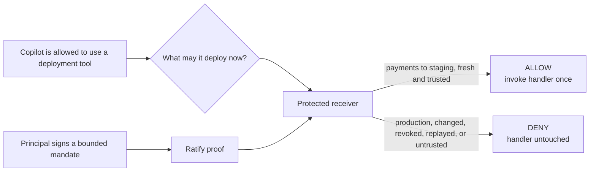
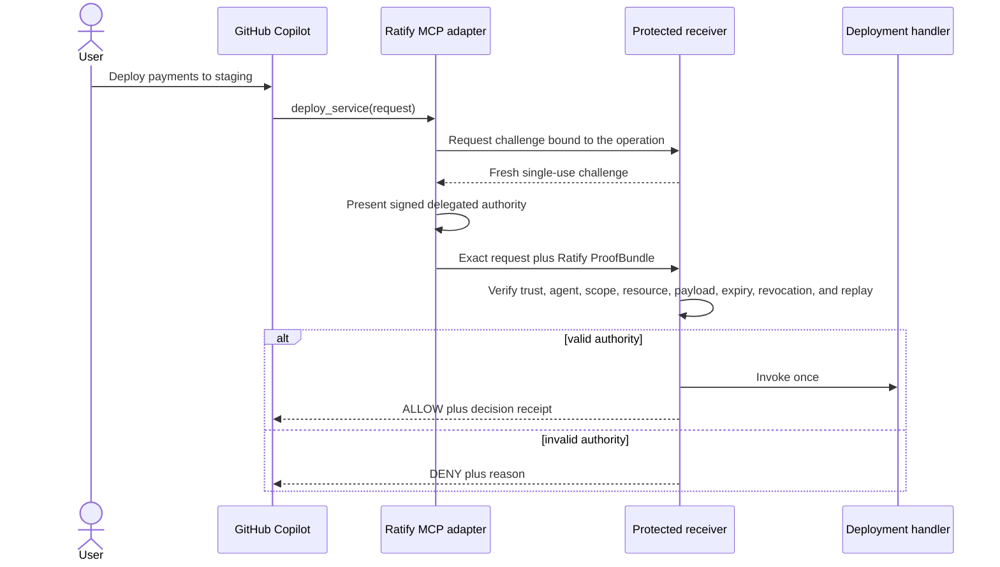
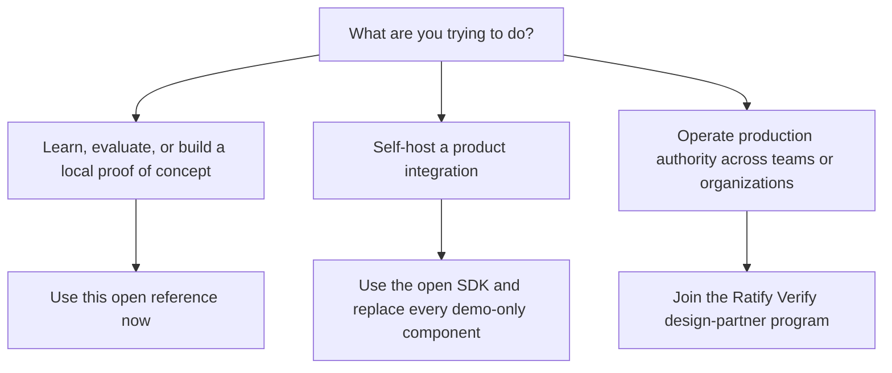

# Receiver-verifiable authority for GitHub Copilot

**Let GitHub Copilot use consequential tools without treating access to a tool
as unlimited authority.**

This live, open reference shows a GitHub Copilot plugin invoking an MCP
deployment tool while an independently operated receiver verifies that a
recognized principal authorized this agent to perform this exact action on this
exact resource before the protected handler runs.

It is implemented on `main`, tested with GitHub Copilot CLI 1.0.80, and
available to use now. It is an independent Ratify Protocol project, not a
GitHub- or Microsoft-endorsed integration.

[Run it with Copilot](#use-it-now-with-github-copilot) ·
[See what it proves](#what-the-reference-proves) ·
[Choose open source or Ratify Verify](#which-path-should-i-use)

## Why would a developer or enterprise need this?

GitHub and Copilot already provide important controls over access: which users,
agents, repositories, plugins, MCP servers, credentials, and tools are
available. Ratify is complementary. It gives the system that owns the
consequence evidence of the narrower mandate behind one action.

| Question | GitHub and Copilot controls | Ratify authority |
| --- | --- | --- |
| Can this agent reach the tool? | Yes | Not its purpose |
| Does the agent have a usable credential? | Yes | Not its purpose |
| Did a recognized principal authorize this exact action? | Not expressed by tool access alone | Yes |
| Is the authority limited to this repository, service, and environment? | Repository and tool policy may constrain access | Signed into the delegation and checked by the receiver |
| Can another organization verify the mandate independently? | Depends on shared platform and credential policy | Yes, using portable proof and configured trust roots |
| Was the proof changed, revoked, expired, or replayed? | Separate control | Verified before the handler runs |

The practical distinction is simple:



This matters when:

- a coding agent holds credentials broader than the current task;
- production actions need stronger evidence than a prompt or approval click;
- an MCP or SaaS provider receives calls from agents it did not issue;
- customer, vendor, or partner agents cross an organizational boundary; or
- security and audit teams need to answer who authorized what, for which agent,
  resource, operation, and time window.

The outcome is not “more cryptography.” The outcome is that enterprises can
permit more agent automation while the receiver retains a precise, auditable,
fail-closed decision boundary.

## What does this reference do?

The included principal delegates only:

```text
scope       custom:github:deploy
repository  identities-ai/copilot-authority-demo
path        /services/payments/environments/staging
```

Copilot sees one ordinary MCP tool named `deploy_service`. The model never
receives the signing key and never constructs the Ratify proof.



The receiver—not the prompt, skill, model, or adapter—is the enforcement
boundary. A caller cannot reach the protected handler by skipping Ratify proof
presentation.

## What the reference proves

| Request | Receiver decision | Protected handler |
| --- | --- | ---: |
| Payments to staging with fresh valid authority | Allow | Invoked once |
| Payments to production | Deny | Not invoked |
| Different repository | Deny | Not invoked |
| Artifact changed after challenge issuance | Deny | Not invoked |
| Revoked delegation | Deny | Not invoked |
| Replayed proof | Deny | Not invoked again |
| Untrusted principal | Deny | Not invoked |

Seven deterministic tests pass with zero failures and zero skips. The plugin was
also installed directly from this public GitHub repository and exercised
through Copilot CLI against the independent receiver.

## Use it now with GitHub Copilot

This path runs a safe reference handler that increments a counter. It does not
deploy real infrastructure.

### 1. Install and authenticate Copilot CLI

You need Node.js 22 or later and an active Copilot plan with Copilot CLI
enabled.

```bash
npm install -g @github/copilot
copilot login
```

GitHub also documents Homebrew, WinGet, and standalone installation options in
the [Copilot CLI installation guide](https://docs.github.com/en/copilot/how-tos/copilot-cli/set-up-copilot-cli/install-copilot-cli).

### 2. Install the Ratify plugin from this repository

```bash
copilot plugin install identities-ai/ratify-protocol:references/github-copilot
copilot plugin list
```

`ratify-authority` should appear in the installed plugin list. Direct repository
installation works today; Copilot CLI currently warns that direct installs will
eventually move to marketplace-only distribution. A Ratify marketplace listing
is planned. The plugin contains a self-contained runtime and does not run
`npm install` when Copilot loads it.

### 3. Start the open reference receiver

In terminal one:

```bash
git clone https://github.com/identities-ai/ratify-protocol.git
cd ratify-protocol/references/github-copilot
npm ci
npm run receiver
```

The receiver listens on `http://127.0.0.1:8787`. It owns the protected mock
handler and independently verifies every proof.

### 4. Ask Copilot to use the protected tool

In terminal two, from any trusted working directory:

```bash
copilot
```

Then ask:

```text
Use the Ratify deploy tool to deploy repository
identities-ai/copilot-authority-demo, service payments, environment staging,
artifact digest sha256:9f86d081884c7d659a2feaa0c55ad015,
invocation ID my-first-ratify-deploy.
```

Approve the MCP tool when Copilot asks. The expected result includes:

```json
{
  "allowed": true,
  "reason": "authorized",
  "handler_invocations": 1,
  "receipt": {
    "scope": "custom:github:deploy",
    "resource": "github:identities-ai/copilot-authority-demo",
    "path": "/services/payments/environments/staging",
    "invocation_id": "my-first-ratify-deploy"
  }
}
```

Try changing `staging` to `production`. The receiver denies the request and the
protected handler remains untouched.

## Run without Copilot

To inspect the protocol boundary or contribute to the implementation:

```bash
git clone https://github.com/identities-ai/ratify-protocol.git
cd ratify-protocol/references/github-copilot
npm ci
npm run check
npm run demo
```

The gate compiles the source, runs all seven allow and deny tests, and rebuilds
the distributable plugin runtime.

## Which path should I use?



| Your situation | Recommended path | Available now? |
| --- | --- | --- |
| Understand the model or run the Copilot demonstration | This open reference | Yes |
| Build an internal prototype with your own receiver | Fork this reference and use the open SDK | Yes |
| Self-host production verification | Use the open protocol and SDK, with production key custody, TLS, durable state, policy, and audit | Build and operate it yourself |
| Need managed multi-tenant trust, revocation, replay protection, policy, receipts, audit, availability, or support | Ratify Verify | Under development; design partners wanted |

### Open source

Use the open reference and SDK when you want inspectable protocol semantics,
local evaluation, customization, or full operational ownership. The proof
format and receiver decision remain portable. This repository is the immediate
starting point.

Do not deploy the reference unchanged to production. Its keys are public test
material, its state is in memory, its receiver uses local HTTP, and its handler
is intentionally a counter.

### Ratify Verify

Ratify Verify is the managed commercial path under development. It is intended
for organizations that want Ratify to operate the verification control plane:

- tenant-specific trust roots and organization connections;
- durable atomic challenges and replay protection;
- fresh revocation and policy decisions;
- signed verification receipts and audit retention; and
- production availability, observability, and support.

If that matches your deployment, contact
[chuks@ratifyprotocol.com](mailto:chuks@ratifyprotocol.com?subject=Ratify%20Verify%20design%20partner)
with “Ratify Verify design partner” in the subject. Useful context includes the
agent runtime, protected action, receiving system, organizational boundary, and
compliance or audit requirement. This is the current lead and design-partner
path; Ratify Verify is not yet offered here as a generally available service.

## What is cryptographically bound?

The published `@identities-ai/ratify-protocol@1.0.0-alpha.16` TypeScript SDK
verifies:

- the hybrid-signed delegation chain;
- the trusted human root and expected adapter agent;
- the required `custom:github:deploy` scope;
- the canonical GitHub repository and resource path;
- the artifact digest and invocation identifier;
- a receiver-issued, single-use challenge;
- certificate validity and fresh revocation state; and
- operation and session context reconstructed by the receiver.

Changing the request after challenge issuance changes its signed session
binding. Reusing a proof fails because the receiver atomically consumes the
challenge.

## Repository map

| Path | Purpose |
| --- | --- |
| `plugin.json` | Copilot plugin manifest |
| `.mcp.json` | Starts the bundled MCP adapter |
| `skills/deploy-with-authority/SKILL.md` | Teaches Copilot when to use the protected tool |
| `plugin-runtime/mcp-server.js` | Self-contained runtime delivered to plugin users |
| `src/mcp-server.ts` | MCP tool definition |
| `src/adapter.ts` | Challenge retrieval and proof presentation |
| `src/authority.ts` | Reproducible reference identity and delegation |
| `src/receiver.ts` | Independent verification and protected handler boundary |
| `src/request.ts` | Exact operation and session binding |
| `test/authority-boundary.test.ts` | Seven deterministic allow and deny cases |
| `reference-evidence.md` | Executed protocol, Copilot, and clean-install evidence |

## Evidence, security status, and limitations

- [Executed reference evidence](reference-evidence.md)
- [Ratify Protocol specification](../../SPEC.md)
- [Reference profile requirements](../README.md)

This reference is live and maintained as part of Ratify Protocol. It changes no
real infrastructure. The fixed seeds must never be reused for real authority.
The in-memory stores are single-process and intentionally fail closed on
restart. Production deployments must replace every demo-only component listed
above.
