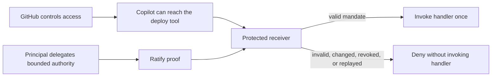
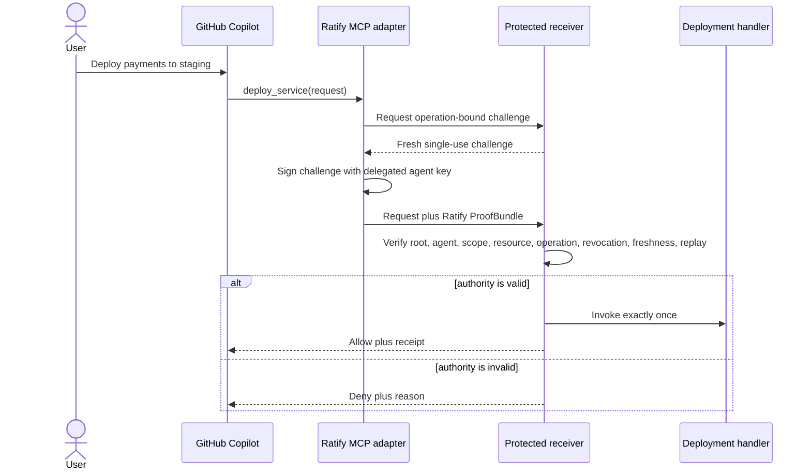

# Ratify authority for GitHub Copilot

Give consequential tools a way to verify what a person authorized an AI agent
to do before the tool acts.

Status: independent Ratify Protocol reference, natively exercised with GitHub
Copilot CLI 1.0.80. This project is not endorsed by GitHub or Microsoft.

## Why this exists

GitHub controls which agents, repositories, plugins, MCP servers, credentials,
and tools an organization permits. Those controls establish access. A receiver
may still need a narrower answer:

**What did a recognized principal authorize this agent to do for this exact
operation, resource, and moment?**

A credential capable of reaching staging may also technically reach
production. Ratify carries a signed, bounded mandate that the system owning the
consequence can verify independently.



## The value in one minute

This reference delegates only:

```text
scope       custom:github:deploy
repository  identities-ai/copilot-authority-demo
path        /services/payments/environments/staging
```

It produces a visible result:

| Request | Decision | Protected handler |
| --- | --- | ---: |
| Payments to staging with a fresh valid proof | Allow | Invoked once |
| Payments to production | Deny | Not invoked |
| Different repository | Deny | Not invoked |
| Artifact changed after challenge issuance | Deny | Not invoked |
| Revoked delegation | Deny | Not invoked |
| Replayed proof | Deny | Not invoked again |
| Untrusted principal | Deny | Not invoked |

The reference makes the missing boundary concrete: possession of a credential
does not become unlimited authority.

## How it works

Copilot sees one ordinary MCP tool named `deploy_service`. It never receives the
signing key or constructs the Ratify proof.



The receiver is the security boundary. Prompt instructions, skills, and the MCP
adapter improve integration, but only receiver-side verification controls the
protected handler.

## Five-minute local run

Prerequisites:

- Node.js 22 or later
- GitHub Copilot CLI 1.0.80 or later for the native path
- An active Copilot plan with Copilot CLI enabled

Install dependencies and run the deterministic gate:

```bash
npm ci
npm run check
npm run demo
```

Expected result: seven tests pass with no failures or skips. The demo allows one
staging request, denies replay and mutation, and ends with handler count one.

### Run through GitHub Copilot CLI

Start the independently running receiver in terminal one:

```bash
npm run receiver
```

Start Copilot with the local plugin in terminal two:

```bash
copilot --plugin-dir "$PWD" --allow-all-tools
```

Ask Copilot:

```text
Use the Ratify deploy tool to deploy repository
identities-ai/copilot-authority-demo, service payments, environment staging,
artifact digest sha256:9f86d081884c7d659a2feaa0c55ad015,
invocation ID my-first-ratify-deploy.
```

The receiver returns a receipt similar to:

```json
{
  "allowed": true,
  "reason": "authorized",
  "handler_invocations": 1,
  "receipt": {
    "scope": "custom:github:deploy",
    "resource": "github:identities-ai/copilot-authority-demo",
    "path": "/services/payments/environments/staging",
    "invocation_id": "my-first-ratify-deploy"
  }
}
```

## Repository map

| Path | Purpose |
| --- | --- |
| `plugin.json` | GitHub Copilot plugin manifest |
| `.mcp.json` | Starts the bundled MCP adapter from the installed plugin |
| `skills/deploy-with-authority/SKILL.md` | Tells Copilot when and how to use the protected tool |
| `plugin-runtime/mcp-server.js` | Self-contained runtime distributed to plugin users |
| `src/mcp-server.ts` | MCP tool definition |
| `src/adapter.ts` | Challenge retrieval and proof presentation |
| `src/authority.ts` | Reproducible reference identity and signed delegation |
| `src/receiver.ts` | Independent verification and protected handler boundary |
| `src/request.ts` | Exact operation and session binding |
| `test/authority-boundary.test.ts` | Seven deterministic allow and deny cases |
| `reference-evidence.md` | Executed protocol and native Copilot evidence |

## Clean-install guarantee

The installed plugin launches `plugin-runtime/mcp-server.js`, a committed
self-contained bundle. It does not require `npm install`, TypeScript, or a
Ratify source checkout at runtime.

The release test copies only the manifest, MCP configuration, skill, and bundled
runtime into a clean directory with no `node_modules`. Copilot CLI loads that
copy and completes an authorized call through the independent receiver.

## What is cryptographically bound

The published TypeScript SDK `@identities-ai/ratify-protocol@1.0.0-alpha.16`
verifies:

- the hybrid-signed delegation chain;
- the trusted human root and expected adapter agent;
- the required `custom:github:deploy` scope;
- the canonical GitHub repository and resource path;
- the artifact digest and invocation identifier;
- a receiver-issued, single-use challenge;
- certificate validity and fresh revocation state; and
- operation and session context reconstructed by the receiver.

Changing a request after challenge issuance changes its session binding. Reusing
the proof fails because the receiver atomically consumes the challenge.

## Distribution

After this reference is merged into the public `identities-ai/ratify-protocol`
repository, install it directly from the repository subdirectory:

```bash
copilot plugin install identities-ai/ratify-protocol:references/github-copilot
```

It can later be listed in a Ratify-owned or community marketplace. GitHub or
Microsoft endorsement is not required to publish an independent plugin. Do not
represent this reference as an endorsed integration or GitHub standard.

## Reference versus production

This is an executed interoperability reference, not a production deployment.
It intentionally uses public deterministic keys, an in-memory challenge store,
an in-memory revocation set, local HTTP, and a counter as the protected handler.

Production deployments replace those pieces with:

- secure adapter key custody or a cloud KMS;
- authenticated principal and delegation workflows;
- authenticated TLS between adapters, receivers, and Ratify Verify;
- durable atomic challenge and replay storage;
- tenant-specific trust roots, revocation, and policy;
- durable signed decision receipts and audit retention; and
- operational monitoring, availability, and incident controls.

The open protocol keeps proof semantics portable. Ratify Verify is the managed
commercial surface for operating trust, revocation, replay protection, policy,
receipts, audit, and availability across organizations.

## Evidence and limitations

- [Executed reference evidence](reference-evidence.md)
- [Ratify Protocol specification](../../SPEC.md)
- [Reference profile requirements](../README.md)

The mock handler changes no infrastructure. The fixed seeds are public test
material and must never be reused for real authority. The in-memory stores are
single-process and intentionally fail closed on restart.
