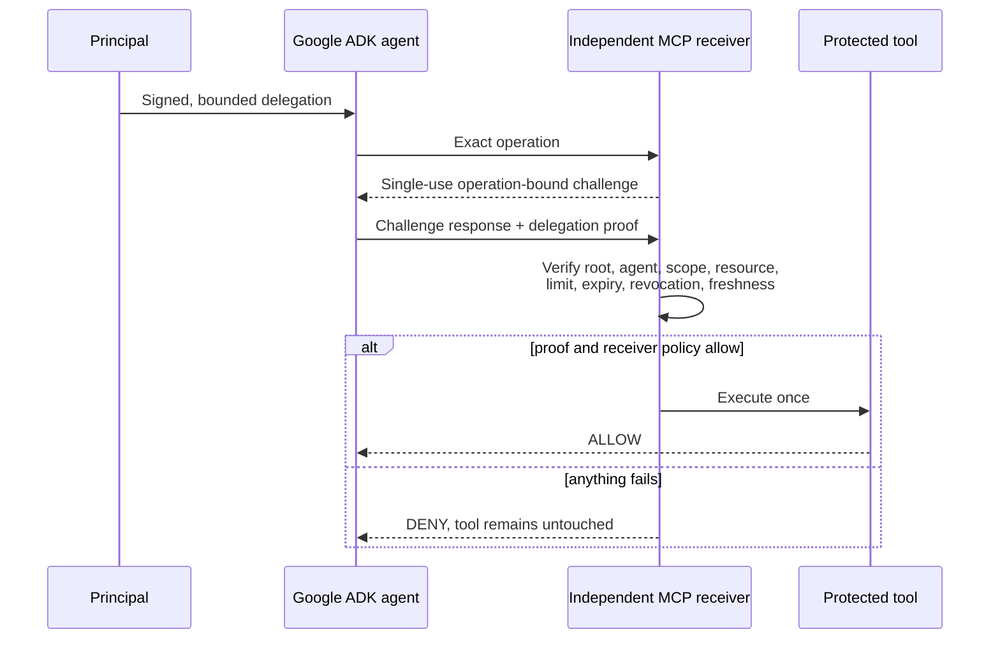
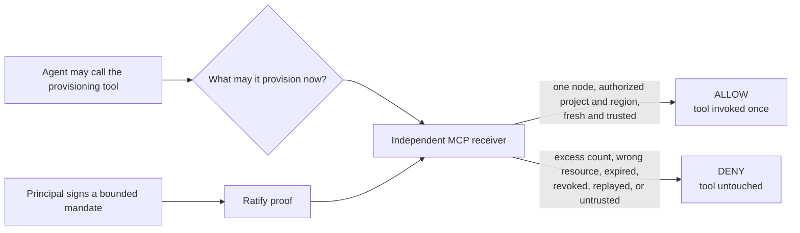

# Proof-carrying authority for Google ADK agents

**Status:** independent draft reference implementation. Not a Google
partnership, Google-approved integration, or Google reference architecture.

This reference answers one narrow question:

> When a Google ADK agent crosses an MCP, A2A, tool, or organizational
> boundary, can the system carrying the consequence independently verify who
> authorized the agent for that exact action and which bounds still apply?

The visible result is intentionally simple:

```text
ALLOW -> tool invoked once
DENY  -> tool invocation count does not change
```

Identity answers **which workload connected**. ADK answers **how the agent
selected and called a tool**. Ratify answers a different question: **which
principal authorized this agent to perform this exact operation, on this
resource, within these signed limits?** The receiver can verify that evidence
without sharing the sender's API key or calling the sender during the decision.



The model may request more authority. It cannot grant that authority to
itself.

## Why would a developer or enterprise need this?

Google Cloud and ADK already provide substantial controls: IAM on the resource,
service identity for the workload, and ADK's own tool and callback surface for
what an agent may select. Ratify is complementary. It gives the system carrying
the consequence evidence of the narrower mandate behind one action.

| Question | Google Cloud / ADK controls | Ratify authority |
| --- | --- | --- |
| Can this workload reach the API? | Yes, through IAM and service identity | Not its purpose |
| Can this agent select this tool? | Yes, through ADK tool configuration | Not its purpose |
| Did a recognized principal authorize this exact action? | Not expressed by workload identity alone | Yes |
| Is the authority limited to this project, region, and node count? | IAM can bound the resource; the per-action ceiling is application logic | Signed into the delegation and checked by the receiver |
| Can a different organization verify the mandate? | Depends on a shared Google Cloud trust domain | Yes, from portable proof and configured trust roots |
| Was the proof changed, revoked, expired, or replayed? | Separate concern | Verified before the handler runs |

Workload identity answers which service is calling. It does not carry which
human or organization sanctioned this particular provisioning request, at this
size, for this project. That distinction matters when an agent holds
credentials broader than the current task, when a receiver serves agents it did
not issue, or when the call crosses an organizational boundary.



## Who implements what

Four roles. **Google implements nothing**: the reference uses ADK's public
agent and tool surface and an ordinary MCP receiver, so no change to ADK,
Gemini, or any Google Cloud service is required.

| Role | Who this usually is | What they do | What they build |
| --- | --- | --- | --- |
| **Principal** | The organization accountable for the cloud resource | Signs a bounded delegation naming scope, resource, node count, and expiry | No code. Issues a delegation with the SDK or Ratify Verify, and decides the bounds |
| **Agent operator** | The team running the ADK agent | Points the agent at the receiver and the trusted principal | No protocol code, but real configuration: receiver address, trust root, and which tools are protected |
| **Receiver operator** | Whoever owns the consequence: the provisioning API or MCP server | Issues challenges, verifies the proof, guards the handler | The verification path: `authority_reference/receiver.py` and the transport boundary in `mcp_server.py`. The verify call is a small part; the rest is challenge issuance, header handling, trust-root comparison, and keeping the handler unreachable except through the allow branch |
| **Google ADK / Gemini** | The agent framework and model | Select and call the tool as they already do | **Nothing** |

The asymmetry is the point. The party carrying the risk is the party that
checks, and it can check without trusting the agent, the model, the prompt, or
the framework that routed the call.

## Which path should I use?

**Use this open reference** when you want to read every line of the decision
path, run it without a Google Cloud account or a model key, and adapt the
receiver to your own service. It is Apache-2.0 with no runtime dependency on a
hosted Ratify service.

**Register interest in Ratify Verify** when you would rather not operate trust
distribution, revocation freshness, challenge storage, and audit retention
yourself. Those are the deployment concerns under "Reference scope and
production requirements" below, and they are what turns a working reference
into a production control.

Both verify the same proofs. The protocol does not change between them.

## Run the published-package gate

You need Bash, Python 3.11 (the tested version), and network access to install
the pinned packages. You do not need a Google API key or Google Cloud project
for this gate.

From the Ratify repository root:

```bash
./scripts/google-adk-reference-check.sh
```

The script creates an isolated demo virtual environment, installs the exact
published packages in `requirements.txt`, refuses to run if Ratify resolves to
this repository's local Python SDK, runs the deterministic adversarial suite,
and then runs the three-case demonstration.

Tested pins:

- `google-adk==2.6.3`
- `mcp==1.29.0`
- `ratify-protocol==1.0.0a19`
- `pytest==9.0.3`

The deterministic path needs no API key, Google Cloud project, or paid
service. It drives the real ADK runner with a scripted model double, so ADK
still performs model-turn handling, tool selection, tool execution, and
function-response delivery. The authorization result cannot depend on model
judgment.
The recorded run is in
[`evidence/reference-evidence.md`](evidence/reference-evidence.md).
The gate requires exactly 33 passing tests and fails if any test is skipped,
xfail, missing, or unexpectedly added.

## What the reference implements

```text
Principal
  signs root -> ADK commander
        scope: custom:infra:provision + identity:delegate
                  |
                  v
ADK commander
  signs commander -> infrastructure specialist
        scope: custom:infra:provision
        resource: gcp:projects/customer-project/regions/us-central1
        extension constraint: max_nodes = 1
                  |
                  v
Google ADK native McpToolset
  exposes only ordinary business arguments to the model
  obtains an operation-bound challenge after tool selection
  signs it with the specialist key and injects the proof
                  |
                  v
Independent Streamable HTTP MCP receiver
  pins the accepted principal root out of band
  reconstructs the operation and payload digest
  binds the challenge to verifier, workspace, agent, session, invocation,
    and operation hash
  atomically consumes the single-use challenge
  checks revocation, chain signatures, scope, resource, node count, and expiry
  invokes the protected tool only after ALLOW
```

The `com.ratifyprotocol.adk.max_nodes` extension is a draft Ratify integration
profile. It is deliberately not placed in a Google namespace and does not
claim that Google defines or endorses it. The prefix follows the protocol's
reverse-domain convention and is based on `ratifyprotocol.com`, a domain
controlled by the Ratify Protocol project.

## Code map

Start with these files if you want to inspect or adapt the reference:

| File | Responsibility |
|---|---|
| [`authority_reference/authority.py`](authority_reference/authority.py) | Issues the principal-to-commander and commander-to-specialist delegations |
| [`authority_reference/adk_mcp.py`](authority_reference/adk_mcp.py) | Keeps the model-facing schema ordinary, then obtains a challenge and injects the proof after ADK selects the tool |
| [`authority_reference/receiver.py`](authority_reference/receiver.py) | Reconstructs the operation, verifies the proof and local policy, and gates the protected handler |
| [`authority_reference/mcp_server.py`](authority_reference/mcp_server.py) | Exposes the receiver through authenticated Streamable HTTP MCP |
| [`authority_reference/deployment_config.py`](authority_reference/deployment_config.py) | Writes separate receiver and presenter configuration with mode `0600` |
| [`tests/test_reference.py`](tests/test_reference.py) | Exercises the ADK runner, MCP boundary, trust-root attacks, replay, malformed input, concurrency, and availability behavior |

When adapting this profile to another tool, keep the receiver in control of
the trust root, operation construction, challenge issuance, and final policy
decision. Bind the proof to the exact operation and receiving context. Consume
the challenge once, and call the protected handler only after verification
returns `allow`. Keys and proof bytes should stay outside model context.

## Layer separation

| Layer | Question answered | This reference does not claim |
|---|---|---|
| Google Agent Identity / IAM | Which deployed agent workload is calling, and which Google Cloud permissions does it have? | That the workload carries a principal-signed grant for this exact cross-boundary action |
| Google ADK | How does the agent reason and invoke a tool? | That MCP transport alone proves delegated authority |
| MCP / A2A / tool transport | How does the request cross the boundary? | That transport authentication proves the principal's bounded intent |
| Ratify | Who delegated authority, for which scope/resource/bounds, and is the presentation fresh and unrevoked? | That the receiver must execute |
| Receiver policy and tool | Is the verified request acceptable now, and should the action execute? | That verifier-supplied context becomes trustworthy without receiver validation |

## Security boundary

The receiver is the security boundary. It performs five actions the presenting
agent is not trusted to perform:

1. Pins the accepted principal root. A valid self-issued chain is denied.
2. Parses and validates the requested operation.
3. Constructs the operation and session bindings itself.
4. Issues and atomically consumes a single-use challenge.
5. Verifies the proof and local policy before the protected handler runs.

The ADK tool is presentation code. It injects the proof so the model never sees
private keys or proof bytes. Moving `verify_bundle` into an ADK callback inside
the agent process would be a useful fail-fast check, but not a security control:
a compromised agent could skip its own callback.

## What the reference proves

The suite encodes why the boundary matters:

| Case | Expected result | Protected tool |
|---|---|---|
| Correct agent, one node, `us-central1` | `allow` | Invoked once |
| Three nodes under a one-node grant | `constraint_denied` | Not invoked |
| `us-east1` under a `us-central1` grant | `constraint_denied` | Not invoked |
| Expired delegation | `expired` | Not invoked |
| Revoked leaf delegation | `revoked` | Not invoked |
| Replayed presentation | `invalid` / consumed challenge | Not invoked again |
| Operation changed after challenge issuance | `operation_binding_failed` | Not invoked |
| Different agent answers the challenge | `agent_binding_failed` | Not invoked |
| Valid chain under an untrusted root | `untrusted_root` | Not invoked |
| Non-integral, zero, negative, boolean, or excessive node count | Input rejected | Not invoked |
| Duplicate transport-authentication headers | HTTP `400` before MCP dispatch | Not invoked |

## Optional live Gemini path

The deterministic suite is authoritative. To let Gemini select and invoke the
same ADK tool interactively, run the published-package gate above first. It
creates the `.venv` used below. Then run:

```bash
cd references/google-adk
source .venv/bin/activate
python bootstrap_live.py
python -m authority_reference.mcp_server \
  --trust-config .local/receiver-trust.json --port 8765
```

`bootstrap_live.py` creates `.local/receiver-trust.json` and
`.local/presenter.json`. Both contain secrets and are written with mode `0600`.
Remove `.local/` before generating a new authority.

In a second shell:

```bash
cd references/google-adk
source .venv/bin/activate
export GOOGLE_API_KEY=your_key
export RATIFY_PRESENTER_CONFIG=.local/presenter.json
export RATIFY_MCP_RECEIVER_URL=http://127.0.0.1:8765/mcp
adk run adk_app
```

Example prompt:

```text
Provision one n2-standard-4 node in us-central1. Use request id demo-1.
```

Then request three nodes or change the region and observe the receiver denial.
The app defaults to `gemini-3.6-flash`, Google's current stable Flash model as
of this evidence date. The optional live path demonstrates orchestration; it
adds no authorization guarantee beyond the deterministic receiver tests.

## Evidence tiers

| Tier | Executed here | Meaning |
|---|---|---|
| Receiver verification | Yes | Cryptographic and local-policy allow/deny matrix |
| ADK `FunctionTool` | Yes | Baseline in-process composition |
| Native ADK `McpToolset` | Yes | Ordinary schema; hidden proof injection; independent HTTP receiver |
| ADK runner loop | Yes | Model turn → MCP function call → gated receiver → function response |
| Gemini 3.6 Flash | Configuration-ready | Requires an operator API key; not part of recorded evidence |
| A2A / Agent Engine | Not yet | Proposed follow-on, not claimed as executed |

## Reference scope and production requirements

- The receiver and challenge store are in-memory inside one MCP server process.
- The protected provisioner is a counter, not Google Compute Engine. No cloud
  resources are created.
- Trust-root distribution, durable revocation, shared challenge storage, key
  custody, authorization receipts, rate limits, and production audit retention
  are deployment responsibilities not solved by this draft.
- The logical `gcp:` resource name is an integration profile. Verification
  proves authorization against the receiver-supplied logical resource; the
  execution layer must still ensure the real cloud operation matches it.
- This reference composes with Agent Identity conceptually but does not deploy
  to Vertex AI Agent Engine or exercise preview IAM Agent Identity APIs.
- Proof injection uses a small pinned-version `McpTool` adapter because ADK does
  not expose operation-specific hidden MCP metadata as a stable public hook.
  The adapter is isolated and tested, but should be mapped with the ADK team
  before claiming forward compatibility.
- The internal challenge tool remains MCP-discoverable to authenticated clients
  but is excluded from the model toolset. Authentication, bounded receiver
  state, and receiver verification, not client-side hiding, are the controls.
- This is deliberately one concrete infrastructure-tool profile, not a claim
  that arbitrary MCP schemas can be wrapped without an explicit authority map.
- Dependencies are version-pinned but not installed with artifact hashes; the
  evidence records the requirements file hash, not a supply-chain attestation.
- The local profile uses one static transport token. Any holder can consume the
  bounded 128-operation pending capacity until its five-minute TTL expires;
  production deployments need per-workload authentication and rate limits.
- Protected execution is at-most-once, not exactly-once. If the response is
  lost after execution, replay is denied; a production tool needs an
  idempotency/result ledger before an operator retries the business action.
- The executed draft uses the real ADK runner and native `McpToolset` across an
  independently started Streamable HTTP MCP receiver with receiver-owned trust
  configuration. It does not yet execute A2A, TLS workload authentication,
  Agent Engine, or Agent Identity deployment.

## Sources

- Google Agent Identity: <https://docs.cloud.google.com/iam/docs/auth-agent-own-identity>
- Google ADK: <https://github.com/google/adk-python>
- ADK MCP tools: <https://google.github.io/adk-docs/tools-custom/mcp-tools/>
- Gemini API release notes: <https://ai.google.dev/gemini-api/docs/changelog>
- Ratify Protocol: <https://github.com/identities-ai/ratify-protocol>
- Agent Relay integration note: <https://ratifyprotocol.com/writing/agent-relay-phase1-technical-note>
