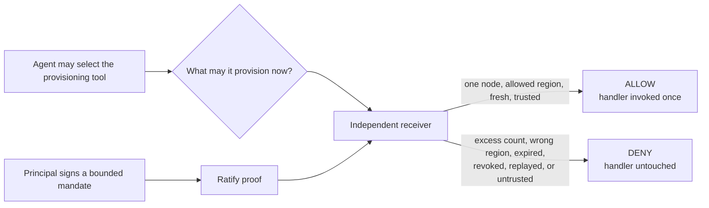
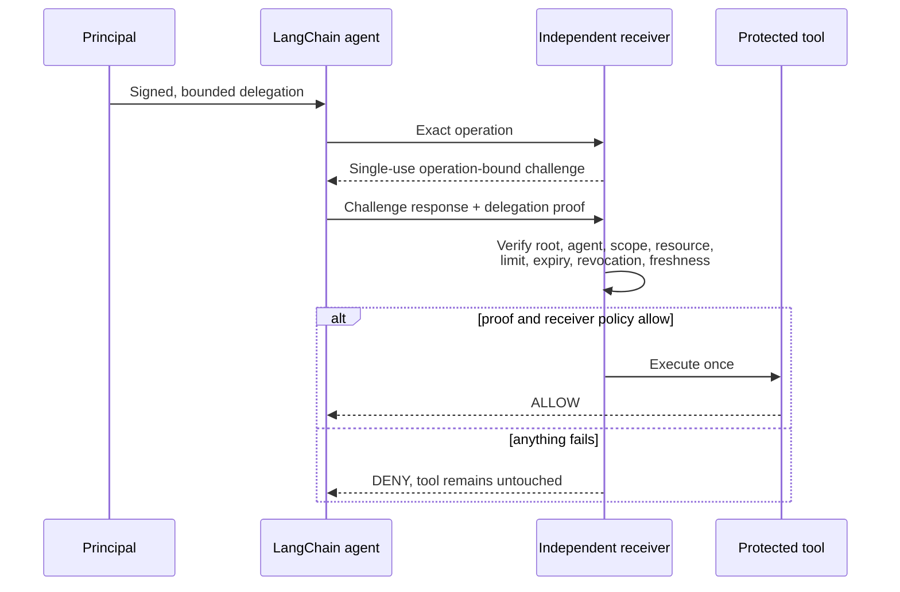

# Proof-carrying authority for LangChain agents

**Status:** independent draft reference implementation. Not a LangChain
partnership, LangChain-approved integration, or LangChain reference architecture.

This reference answers one narrow question:

> When a LangChain agent crosses an MCP or organizational boundary, can the
> receiver independently verify who authorized that agent for the exact action
> and which bounds still apply?

## Why would a developer or enterprise need this?

LangChain and LangSmith already provide real controls: which agents run, which
tools they may select, which credentials they carry, and who may reach the Agent
Server. Ratify is complementary. It gives the system that carries the
consequence evidence of the narrower mandate behind one action.

| Question | LangChain / LangSmith controls | Ratify authority |
| --- | --- | --- |
| Can this agent select this tool? | Yes | Not its purpose |
| Does the agent hold a usable credential? | Yes | Not its purpose |
| Did a recognized principal authorize this exact action? | Not expressed by tool access alone | Yes |
| Is the authority limited to this region, size, and count? | Application logic may check | Signed into the delegation and checked by the receiver |
| Can a different organization verify the mandate? | Depends on shared platform and credentials | Yes, from portable proof and configured trust roots |
| Was the proof changed, revoked, expired, or replayed? | Separate concern | Verified before the handler runs |

This matters when a LangChain agent holds credentials broader than the current
task, when an MCP or SaaS provider receives calls from agents it did not issue,
when agents cross an organizational boundary, or when an audit has to answer who
authorized what, for which agent, resource, and time window.



## Who implements what

Four roles. **LangChain implements nothing**: the reference uses the public
`MultiServerMCPClient` tool-interceptor API and the standard `create_agent`
loop, so no change to LangChain, LangGraph, or LangSmith is required.

| Role | Who this usually is | What they do | What they build |
| --- | --- | --- | --- |
| **Principal** | The organization accountable for the resource | Signs a bounded delegation naming scope, region, count, and expiry | No code. Issues a delegation with the SDK or Ratify Verify, and decides the bounds |
| **Agent operator** | The team running the LangChain agent | Adds the interceptor and points it at the receiver | No protocol code, but real configuration: receiver address, trusted principal, and which tools are protected |
| **Receiver operator** | Whoever owns the consequence: the provisioning API, the MCP server | Issues challenges, verifies the proof, guards the handler | The verification path. Here `authority_reference/receiver.py` plus the HTTP boundary in `mcp_server.py`: the verify call is a small part, and the rest is challenge issuance, header bounds, trust-root comparison, and keeping the handler unreachable except through the allow branch |
| **LangChain / LangGraph** | The agent framework | Selects and calls the tool as it already does | **Nothing** |

The asymmetry is the point. The party carrying the risk is the party that
checks, and it can check without trusting the agent, the model, the prompt, or
the framework that routed the call.

```text
ALLOW -> protected tool invoked once
DENY  -> protected tool invocation count does not change
```

Identity answers **which workload connected**. LangChain answers **which tool
the agent selected**. Ratify answers a different question: **which principal
authorized this agent to perform this exact operation, on this resource, within
these signed limits?** The receiving organization can verify that evidence
without sharing the sender's API key or calling the sender during the decision.



Run the published-package gate from the repository root:

```bash
./scripts/langchain-reference-check.sh
```

The gate creates a clean environment and uses the real `create_agent` LangGraph loop with a deterministic model
double, the public `MultiServerMCPClient` tool-interceptor API, and an
independently started Streamable HTTP MCP receiver. It needs no model API key or
paid service. It requires exactly 24 passing tests and fails on a skipped,
xfail, missing, or additional test. See
[`evidence/reference-evidence.md`](evidence/reference-evidence.md).

## Boundary

The model sees only `request_id`, `region`, `instance_type`, and `count`. After
tool selection, a LangChain MCP interceptor obtains an operation-bound challenge,
signs it outside model context, and adds the proof as a per-call HTTP header.
The receiver pins the accepted root and expected agent out of band, reconstructs
the operation, consumes the challenge, verifies the delegation, and invokes the
protected handler only after ALLOW.

LangChain and LangGraph orchestrate the agent. LangSmith authentication and
authorization protect Agent Server resources and can supply user-scoped
credentials. MCP transports the tool call. Ratify adds portable evidence of the
principal's bounded authority for the exact action. Receiver policy still makes
the final execution decision.

## What the reference proves

| Boundary case | Expected effect |
|---|---|
| Valid two-hop delegation, one node, allowed region | Receiver invokes the protected handler once |
| Excess count or wrong region | Signed constraint denies before execution |
| Expired or revoked delegation | Denied before execution |
| Replayed proof or changed operation | Denied; prior execution count is unchanged |
| Wrong presenting agent or untrusted root | Denied despite a cryptographically valid hostile proof |
| Malformed proof or invalid business input | Denied without consuming honest work or reaching the tool |
| Duplicate transport/proof headers or oversized proof header | HTTP boundary rejects the request before MCP |
| Missing transport credential | HTTP `401`; MCP receiver is not reached |
| Concurrent duplicate request IDs or exhausted pending capacity | Receiver state remains bounded and unambiguous |
| Real `create_agent` → interceptor → HTTP MCP path | Proof stays out of the model schema and ALLOW reaches the tool |

The deterministic model is deliberate: authorization must not depend on a
model deciding to follow a security instruction. A live model would demonstrate
tool selection, but add no authority guarantee.

The `com.ratifyprotocol.langchain.max_nodes` constraint is a draft Ratify
integration profile in a Ratify-owned namespace. It is not a LangChain-defined
constraint.

## Tested pins

- `langchain==1.3.14`
- `langchain-mcp-adapters==0.3.0`
- `mcp==1.29.0`
- `ratify-protocol==1.0.0a19`

## Which path should I use?

**Use this open reference** when you want to read every line of the decision
path, run it with no account, and adapt the receiver to your own service. It is
Apache-2.0 and has no runtime dependency on any hosted Ratify service.

**Register interest in Ratify Verify** when you would rather not operate trust
distribution, revocation freshness, challenge storage, and audit retention
yourself. Those are the deployment concerns listed under Limitations below, and
they are the parts that turn a working reference into a production control.

Both verify the same proofs. The protocol does not change between them.

## Repository map

| Path | Purpose |
| --- | --- |
| `authority_reference/langchain_agent.py` | The agent and the MCP tool interceptor that carries the proof |
| `authority_reference/mcp_server.py` | HTTP boundary: transport credential, header bounds, duplicate rejection |
| `authority_reference/receiver.py` | Verification and the protected handler boundary |
| `authority_reference/authority.py` | Reference identities and the bounded delegation |
| `authority_reference/deployment_config.py` | Trust roots and expected agent, pinned out of band |
| `tests/test_reference.py` | The 24 deterministic boundary cases |
| `evidence/reference-evidence.md` | Executed evidence for the gate |
| `DESIGN.md` | Architecture and threat-boundary rationale |

## Limitations

- In-memory receiver state fails closed on restart.
- The protected provisioner is a counter; no cloud resources are created.
- Loopback HTTP is used without TLS or production workload identity.
- Trust distribution, durable revocation, shared challenge storage, receipts,
  rate limits, key custody, and audit retention remain deployment concerns.
- Proof headers are an independent integration profile, not an MCP or LangChain
  standard. The two-certificate presentation is about 28 KB. This
  reference rejects presentations over 64 KiB, but many production proxies
  default to a much smaller per-header limit. Do not deploy this carrier without
  aligning every hop's limits and log redaction. A standardized MCP metadata or
  body carrier is the preferred maintainer-reviewed production path, especially
  for deeper post-quantum chains.
- Execution is at-most-once, not exactly-once; production retries require an
  idempotency and result ledger.
- LangSmith deployment, Agent Server custom auth, durable checkpoints, and live
  hosted models are composition-ready but not exercised or claimed here.

See [DESIGN.md](DESIGN.md) for the architecture and threat-boundary rationale.
