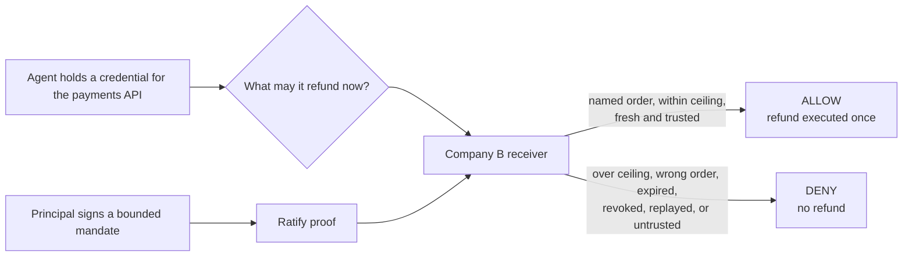
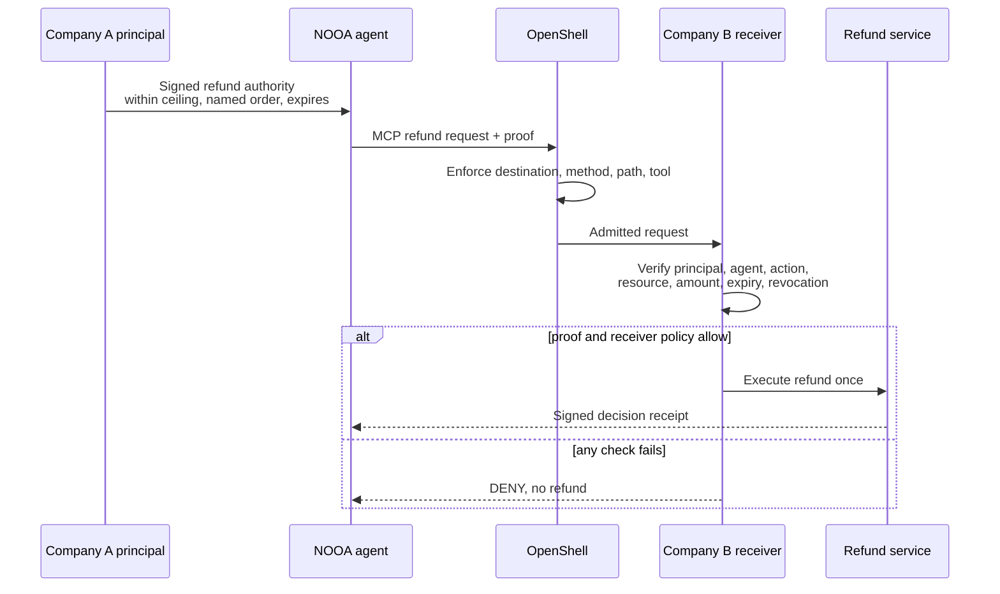

# NVIDIA OpenShell and NOOA authority reference

**An agent at one company asks another company's service to move money. The
service verifies who authorized that agent, for exactly this action, within
exactly these limits, before it acts.**

A working reference for [NOOA](https://github.com/NVIDIA-NeMo/labs-OO-Agents)
and NVIDIA's open agent-security stack. It runs in about five minutes with no
API key, no model, and no paid service. It is an independent Ratify Protocol
project, not an NVIDIA partnership, NVIDIA-approved integration, or NVIDIA
reference architecture.

[Run it](../../demos/nvidia-nooa-delegated-authority/README.md) ·
[Architecture proposal](../../docs/nvidia-open-secure-ai-reference-proposal.md) ·
[Evidence record](../../docs/evidence/nvidia-reference-evidence.json) ·
[PR inventory](../../docs/nvidia-pr-inventory.md)

## Why would a developer or enterprise need this?

A refund agent runs at Company A and calls a payments service at Company B.
Company A's principal intended something precise: *this agent may issue refunds
up to $100, for the next 24 hours, against this order.*

By the time the request reaches Company B, that intent has usually collapsed
into an API key in a header. Company B learns that some caller holding some
credential wants $150 refunded. It does not learn who authorized the agent, that
the ceiling was $100 rather than $10,000, or whether the authority was revoked
ninety seconds ago. It cannot tell whether the agent presenting the credential is
the agent it was issued to.

Company B executes the refund and absorbs the loss. **The party carrying the
risk has the least evidence of anyone in the chain.**

| Question | OpenShell and credential controls | Ratify authority |
| --- | --- | --- |
| Can this agent reach the service? | Yes | Not its purpose |
| Is the call shaped correctly, to an allowed destination? | Yes, OpenShell enforces destination, method, path, and tool | Not its purpose |
| Did a recognized principal authorize this exact action? | Not expressed by a credential | Yes |
| Was the ceiling $100 or $10,000? | Not carried | Signed into the delegation and checked by the receiver |
| Was the authority revoked, expired, or replayed? | Separate concern | Verified before the refund runs |

## How one request runs

The receiver, not the agent and not OpenShell, is the enforcement point for
authority. A caller cannot reach the refund service by skipping proof
presentation.

## Who implements what

Five roles, and **NVIDIA implements nothing**. The reference uses NOOA's public
agent surface and OpenShell's existing egress enforcement, so no change to
either is required.

| Role | Who this usually is | What they do | What they build |
| --- | --- | --- | --- |
| **Principal** | Company A, accountable for the refund | Signs a bounded mandate: ceiling, named order, expiry | No code. Issues a delegation with the SDK or Ratify Verify, and decides the bounds |
| **Agent operator** | The team running the NOOA agent | Carries the proof with the request | No protocol code, but real configuration: the receiver, the trusted principal, and which calls carry proof |
| **OpenShell** | The egress boundary at Company A | Enforces destination, method, path, and tool as it already does | **Nothing.** It constrains where the call may go, not who sanctioned it |
| **Receiver operator** | Company B, carrying the consequence | Verifies principal, agent, action, resource, amount, expiry, and revocation before refunding | The verification path. The receiving service here uses only the Python standard library, because a protocol reference should not need a web framework to be understood |
| **NVIDIA / NOOA** | The agent stack | Runs the agent as it already does | **Nothing** |

OpenShell and Ratify answer different questions and compose. OpenShell decides
whether the call may leave; Ratify gives Company B evidence of the mandate
behind it. Neither substitutes for the other.

## What the reference proves

| Request | Receiver decision | Refund service |
| --- | --- | ---: |
| Refund within the signed ceiling, named order, fresh | Allow | Invoked once |
| Amount above the ceiling | Deny | Not invoked |
| Different order than the one authorized | Deny | Not invoked |
| Expired or revoked authority | Deny | Not invoked |
| Replayed proof | Deny | Not invoked again |
| Untrusted principal | Deny | Not invoked |

181 tests pass with zero skips, against both the in-tree SDK and the published
package. The live OpenShell profile passed 64 of 64 gates.
See [the evidence record](../../docs/evidence/nvidia-reference-evidence.json).

## Which path should I use?

**Use this open reference** to read every line of the decision path and run it
with no account. Apache-2.0, no runtime dependency on a hosted Ratify service.

**Register interest in Ratify Verify** if you would rather not operate trust
distribution, revocation freshness, challenge storage, and audit retention.
Both verify the same proofs.

## Limitations

The executable files remain at their previously shared demo path while NVIDIA
review is pending. This preserves public links and evidence paths; it is not a
second implementation.

The full limitations, what this does not claim, and the production requirements
are stated in
[the executable reference](../../demos/nvidia-nooa-delegated-authority/README.md#what-this-does-not-claim).
