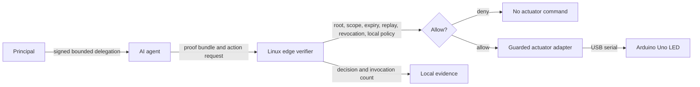
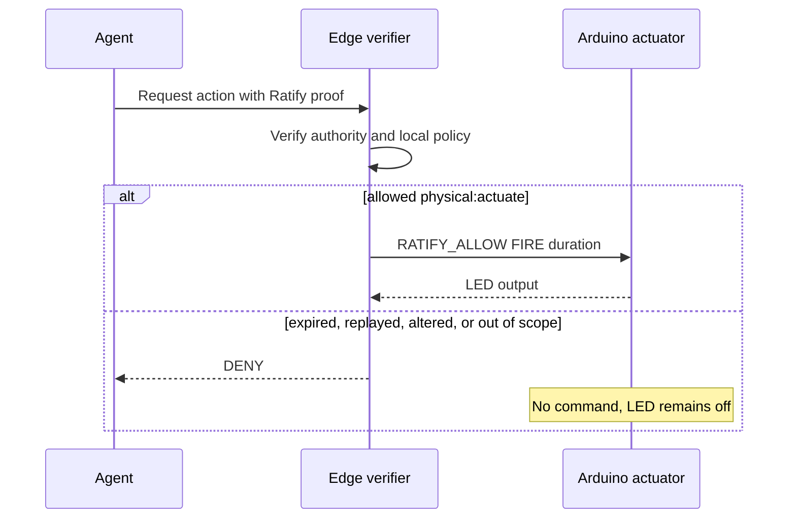

# Ratify Edge Physical AI

**Experimental reference, non-hazardous actuator, pre-RTC.**

This is not a platform partnership, endorsed integration, or approved
reference architecture. It is a self-authored Ratify interoperability example.

This reference shows how an AI agent can request a physical action without
receiving unrestricted control of a machine. A Linux edge receiver verifies
delegated Ratify authority and local device policy before sending one bounded
command to an Arduino Uno LED. The LED is a safe stand-in for a valve, robot
command, instrument, or other actuator. This is not a safety-certified
robotics controller.

## Why this exists

Workload identity answers which process connected. It does not by itself show
which principal approved this exact action, resource, duration, and time window.
Ratify adds portable signed authority that the system carrying the consequence
can verify independently. The edge receiver does not trust the model, prompt,
agent framework, or network connection to make the final decision.

## Who implements what

| Role | Responsibility | Implementation |
| --- | --- | --- |
| Principal | Sets the authority ceiling and signs the delegation | Ratify SDK or Ratify Verify |
| Agent operator | Runs the agent and presents the proof | ADK, LangChain, or another agent runtime |
| Edge operator | Pins the trust root and local policy | Linux receiver in `edge/` |
| Actuator operator | Connects the safe output device | Arduino sketch in `arduino/` |
| Ratify Protocol | Defines proof semantics | Existing Ratify SDKs |

The Arduino is not the authorization boundary. It does not verify proofs, hold
keys, enforce policy, or provide trusted time.

## Architecture



## One request, two outcomes



## Farm-monitor scenario

An agent requests: **open irrigation valve 3 in greenhouse B for 20 seconds**.
The Arduino LED stands in for the valve. A delegation can constrain the
greenhouse, valve, action scope, maximum duration, agent identity, and expiry.
The same pattern applies to warehouse robots, agricultural equipment, drones,
laboratory instruments, charging systems, and other edge-controlled devices.

## Run it yourself

The deterministic gate creates authority, issues a fresh challenge, presents
the proof, and asserts both the decision and actuator invocation count. It does
not require a model key:

```sh
RATIFY_SDK=/path/to/ratify-c ./run-reference-check.sh
```

To use the Arduino actuator after uploading the sketch:

```sh
./edge/edge --trust trust --serial /dev/ttyACM0 --baud 115200
```

The first release uses the test build because the DS3231 RTC is not fitted.
The production binary ignores test clock and revocation overrides and remains
fail-closed without trusted time.

## What it proves

- Ratify proof verification runs on a constrained Linux edge device.
- A valid delegated actuation reaches one safe physical output.
- Monitor, replay, expiry, wrong-scope, wrong-agent, and revoked requests do
  not actuate.
- The actuator can be swapped from GPIO to USB serial without changing the
  authorization path.
- The design is independent of one agent framework.

## What it does not prove

- The Arduino independently enforces authorization.
- Offline authorization survives a power cycle.
- The production binary has successfully actuated hardware.
- Suitability for hazardous, safety-critical, or regulated actuation.

Those claims require the DS3231 installation, offline power-cycle test, and a
separate production hardware acceptance review. No hazardous actuator should be
connected to this reference.

## Open source and commercial path

This is a self-operated interoperability reference. Ratify Verify is the
managed commercial surface for operated trust configuration, revocation,
audit retention, observability, availability, and supported deployment
adapters. The reference is intended for robotics and edge-AI teams that need
bounded, auditable autonomy across hardware, software, sensors, communications,
and agent runtimes. It is not affiliated with or endorsed by any platform
company.

## Status and limitations

Experimental and pre-hardware. The Arduino LED path is tested over USB from the
Raspberry Pi using the test build. Trusted-clock, offline power-cycle, and
production hardware acceptance remain open.
