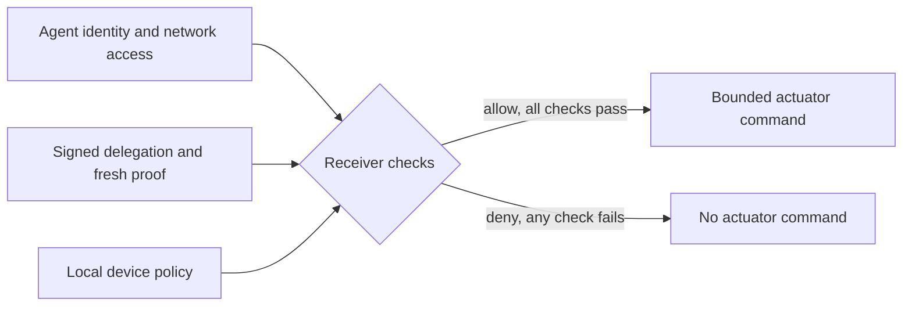
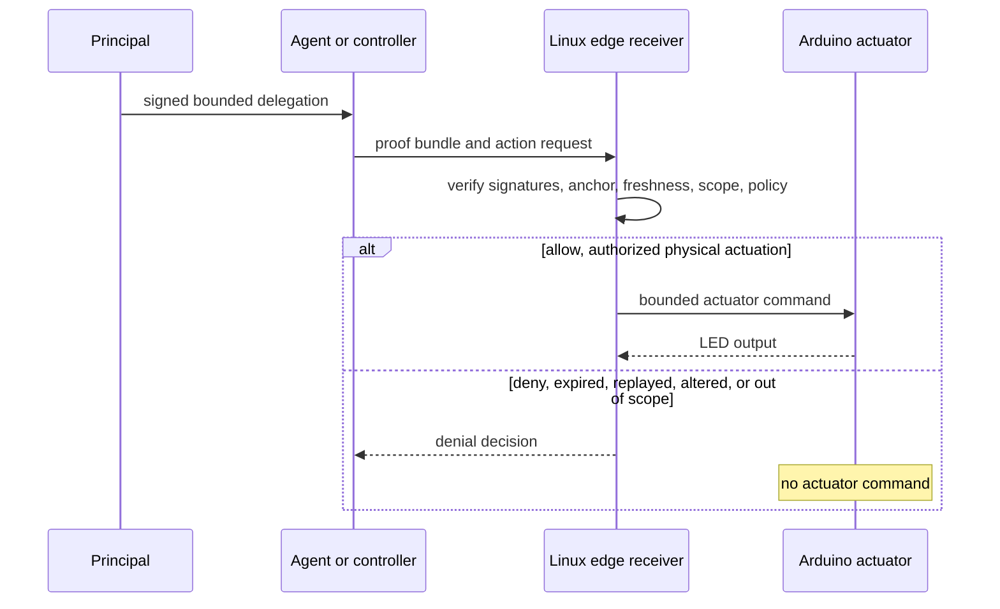

# Ratify Edge Physical AI

**Verify delegated authority at a Linux edge boundary before a bounded physical actuation.**

This experimental reference is self-authored by the Ratify Protocol project. It is not a platform partnership, endorsed integration, or safety-certified reference architecture.

**Start here:** [run it](#use-it-now) · [evidence and limitations](#evidence-security-status-and-limitations) · [open source or Ratify Verify](#which-path-should-i-use)

## Why would a developer or enterprise need this?

Robots, farm equipment, instruments, and edge devices need to decide whether an action is authorized at the point where it has consequences. Network identity and agent-framework permissions are useful controls, but they do not by themselves express which principal approved this exact action, resource, duration, and time window.

| Question | Network and platform controls | Ratify authority |
| --- | --- | --- |
| Can this process reach the receiver? | Usually yes | Not its purpose |
| Did a recognized principal authorize this action? | Not expressed by reachability alone | Signed delegation is checked |
| Is the requested scope and duration within bounds? | Often application-specific | Receiver evaluates proof and local policy |
| Can the decision be checked without a network call? | Depends on deployment | Yes, after proof presentation |



This matters when an agent can call a tool but must not have unlimited authority: agricultural equipment, warehouse robots, drones, laboratory instruments, charging systems, and other edge-controlled devices. Ratify complements IAM, OAuth, MCP, A2A, and local policy; it does not replace them.

## Who implements what

| Role | What it decides or builds | This reference uses |
| --- | --- | --- |
| Principal | Sets the authority ceiling and signs the delegation | Ratify SDK or Ratify Verify |
| Agent operator | Presents the proof and action request | Deterministic controller or the Google ADK adapter in `adk/` |
| Receiver operator | Pins the trust root, local policy, and actuator mapping | Linux receiver in `edge/` |
| Actuator operator | Connects and programs the safe output device | Arduino sketch in `arduino/` |
| Platform vendor | No change required to its platform | Ratify is independent of an agent framework |

The Arduino is an actuator, not the authorization boundary. It does not verify proofs, hold keys, enforce local policy, or provide trusted time. Direct access to the Arduino is outside this reference's security boundary.

## What does this reference do?

The example delegation authorizes a bounded farm action:

```text
scope       physical:actuate
zone        greenhouse-b
resource    irrigation-valve-3
duration    20 seconds maximum
expiry      signed delegation expiry
```

The current hardware maps that valve action to a short LED command over USB serial. No hazardous device is connected.



The Linux receiver is the enforcement boundary. The agent, model, transport, and Arduino cannot turn a denied receiver decision into an authorized decision inside this reference.

## What the reference proves

The deterministic gate runs the 16-row protocol matrix and observes the protected effect:

| Tested case | Decision | Actuator handler |
| --- | --- | --- |
| authorized actuation | authorized | invoked |
| monitor-only request | authorized | not invoked |
| replayed proof | invalid | not invoked |
| expired proof | invalid | not invoked |
| wrong scope | invalid or denied | not invoked |
| wrong agent | invalid or denied | not invoked |
| revoked certificate | revoked | not invoked |
| unavailable revocation state | unavailable | not invoked |

The gate result is **16 passed, 0 failed, 0 skipped**. A Pi 2 ARMv7 serial integration run also observed two authorized invocations and zero invocations for denied requests. The serial run is evidence of the adapter path, not a claim that the Arduino verifies authorization.

## Use it now

Prerequisites: a Linux machine with the current Ratify C SDK source, a C compiler, `make`, and optionally a Raspberry Pi 2 or similar ARMv7 device. The deterministic gate does not require an Arduino, model API, cloud account, or trusted RTC.

1. Clone the protocol repository and enter this reference:

   ```sh
   git clone https://github.com/identities-ai/ratify-protocol
   cd ratify-protocol/references/physical-ai-edge-sentinel
   ```

2. Build or locate the current C SDK, then run the clean gate:

   ```sh
   RATIFY_SDK=/path/to/ratify-c ./run-reference-check.sh
   ```

3. For the optional safe hardware path, upload `arduino/ratify_actuator/ratify_actuator.ino` with Arduino IDE, connect the Uno by USB, and run:

   ```sh
   ./edge/edge --trust trust --serial /dev/ttyACM0 --baud 115200
   ```

   To run the complete end-to-end matrix with the real serial actuator, build `edge-test` and run from `edge/`:

   ```sh
   SERIAL_DEVICE=/dev/ttyACM0 ./tests/e2e.sh
   ```

   This starts the controller, provisions a temporary trust directory, starts the edge verifier, obtains fresh challenges, and presents authorized, monitor, and replay cases. The script asserts both each decision status and the number of actuator invocations. It uses the test clock and quarantine overrides because no DS3231 is installed; it does not represent production clock behavior.

   The restart-replay quarantine case is likewise a test-build scenario:

   ```sh
   EDGE_BIN=./edge-test ./tests/restart_replay.sh
   ```

   The production `edge` binary is intentionally not used for this case before a trusted RTC is installed, because it must refuse to issue challenges without trusted time.

The shipped production receiver fails closed without trusted time and revocation state. The local test build is used for the pre-RTC demonstration only; do not attach a hazardous actuator.

### Run through Google ADK

The adapter in [`../../adk/edge_agent.py`](../../adk/edge_agent.py) is a real ADK `FunctionTool`. It hides proof construction from the model, obtains the edge challenge, and submits the signed bundle to `/action`. See [`../../adk/README.md`](../../adk/README.md) for the pinned environment and receiver setup.

## Which path should I use?

Use this open reference when you need inspectable source, a deterministic local gate, and a safe demonstration of the verification boundary. Use [Ratify Verify](https://ratifyprotocol.com) when you need managed trust configuration, revocation operations, audit retention, observability, availability, and supported deployment adapters.

## What is cryptographically bound?

Ratify signatures bind the delegation and proof fields defined by the protocol, including issuer and subject identities, delegated scope, constraints, expiry, and a fresh challenge response. This edge transport also derives a session context from the requested scope, zone, duration, resource identifier, and invocation identifier. The challenge store binds that context, and the receiver recomputes and requires the same context before accepting the proof; changing any of those inputs fails closed. The receiver separately applies its pinned-root comparison, current time, revocation state, and local device policy. The Arduino serial command is not cryptographically bound and must not be treated as an authorization proof.

## Repository map

| Path | Purpose |
| --- | --- |
| `edge/` | Linux verifier, policy, replay store, and actuator adapters |
| `controller/` | Deterministic controller that provisions and presents test proofs |
| `scenarios/` | Positive and negative protocol fixtures |
| `arduino/ratify_actuator/` | Safe Uno serial actuator sketch |
| `run-reference-check.sh` | Clean, reproducible reference gate |
| `docs/evidence.md` | Hardware and software evidence with explicit limits |
| `../../adk/` | Google ADK tool adapter and setup instructions |
| `ratify-reference.json` | Reference metadata and gate declaration |

## Evidence, security status, and limitations

Evidence is recorded in [`docs/evidence.md`](docs/evidence.md). The reference was exercised against Ratify alpha.19 on a Raspberry Pi 2 ARMv7 target, with a fresh C SDK build and 16 passing protocol rows. The Arduino LED path was exercised over USB serial.

The Google ADK adapter is implemented and statically checked, but the physical Pi run used the deterministic C controller rather than a live ADK model runner. This reference does not claim that the Arduino independently authorizes actions, that offline authorization survives a power cycle, that the production binary has passed hardware acceptance, or that the design is suitable for hazardous, safety-critical, or regulated actuation. The DS3231 trusted-clock installation, offline power-cycle test, and production hardware acceptance remain future work.

## Open source status

This is an experimental, self-operated interoperability reference. Ratify Protocol and this reference are not endorsed by Arduino, Raspberry Pi, Google, LangChain, NVIDIA, or any other platform or hardware vendor.
